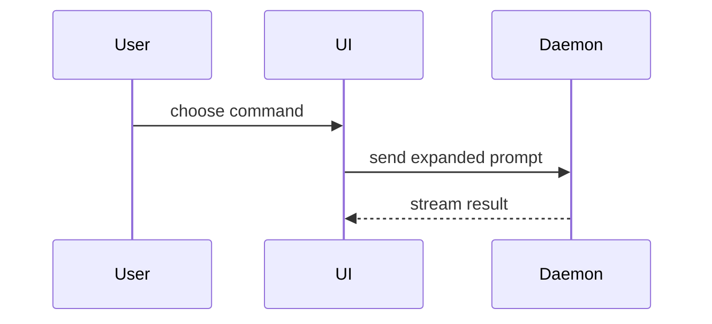

# Diagram it

Help the user understand the current topic visually. Skip the preamble and keep prose brief. Pick the smallest view
that makes the key point clear, and put each view next to the one or two sentences it supports.

The user reads your reply in a terminal. Plain-text views (trees, box drawings, pseudocode, diffs) render there;
Mermaid shows up as source code unless the user views the reply elsewhere. Default to plain text; use Mermaid only
when the user asks for it or will paste it into something that renders it.

## Build it from the code, not from memory

Every name in a view (function, file, component, state, endpoint) must exist. Find them in the REPL first, then draw:

```python
callers = await bash("rg -n 'createSession\\(' src")      # who calls it
shape = await bash("git ls-files src/sessions | head -40")   # what files exist
change = await bash("git diff --stat HEAD~1")               # what a change touched
```

Before you reply, check the names you drew:

```python
names = ["submitForm", "createSession", "persistPrompt", "launchAgent"]
missing = [n for n in names if not (await bash(f"rg -q -w {n} src")).ok]  # rg exits 1 when nothing matches
print(missing or "all names found")
```

Drop or fix anything in `missing`. When a view shows intent rather than existing code (a proposal), say so above it.

## Pick the view

- Logic or an algorithm as pseudocode:

```text
on(save)
  if content is unchanged
    return cached result
  write new content
  return fresh result
```

- Runtime control flow as a call tree (callers from `rg`, order from reading the function bodies):

```text
submitForm
  createSession
    persistPrompt
    launchAgent
  navigateToSession
```

- UI structure as a component tree, with the state and module boundaries that matter:

```tsx
<SessionPage> (apps/example/src/routes/session.tsx)
  useSessionEvents()
  <SessionToolbar>
    <RunSkillButton> (packages/ui)
```

- File responsibility or a broad refactor as a shallow file tree:

```text
src/
├── commands/       # parses user actions
├── sessions/       # owns session state
└── transport/      # sends API requests
```

- Component interaction or data flow as a box drawing (renders in the terminal):

```text
┌──────┐  choose command   ┌────┐  expanded prompt   ┌────────┐
│ User │ ────────────────▶ │ UI │ ─────────────────▶ │ Daemon │
└──────┘                   └────┘ ◀───────────────── └────────┘
                                     stream result
```

- A state machine as transitions, one per line:

```text
idle ──submit──▶ running ──done──▶ finished
                 running ──error─▶ failed ──retry──▶ running
```

- The same as Mermaid when it will be rendered:



- `diff` when the point is what changes and the surrounding shape already exists. Match the diff to the topic; for a
  real change, start from `git diff` rather than retyping it.

A component change:

```diff
 <SessionPage>
   useSessionEvents()
   <SessionToolbar>
+    <RunSkillButton />
   <SessionTimeline>
+    <SkillResultCard />
```

A file-layout change:

```diff
 src/
 ├── commands/
+│   └── show-me.ts       # expands the slash command
 ├── sessions/
-└── transport.ts
+└── transport/
+    ├── client.ts
+    └── stream.ts
```

A call-tree change:

```diff
 submitForm
   createSession
     persistPrompt
+    expandSkillMention
     launchAgent
-  navigateToSession
+  navigateToSession
+    subscribeToEvents
```

A state or control-flow change:

```diff
 on(save)
-  write content
+  if content is unchanged
+    return cached result
+  write new content
+  invalidate cache
```

- The whole block when most of it is new, when omitted context would hide ownership or order, or when the user needs
  a copyable target shape:

```ts
function expandSkill(command: string): string {
  const skillName = command.slice(1)
  return `use the ${skillName} skill`
}
```

## When text cannot carry it

For a visual UI, a layout, a side-by-side state comparison, or a concept too dense for text, write one focused HTML
file: a diagram, an infographic or a short slide deck, whichever fits the point. Match the product's colors, type,
spacing and components; use real labels and data from the code; support desktop and mobile; keep it to one
self-contained file with no network dependencies.

```python
path = "diagram-it-session-flow.html"  # in the working directory, named for what it shows
await write(path, html)
opener = "open" if (await bash("uname")).output.strip() == "Darwin" else "xdg-open"
has_display = opener == "open" or bool((await bash("printenv DISPLAY WAYLAND_DISPLAY")).output.strip())
if has_display:
    await bash(f"{opener} {path}", yield_after=0)
print(path)
```

Always give the user the path: over SSH or in a container nothing opens, and the file is what they take away. To
check a page yourself, render it if a browser MCP server or headless browser is available and look at the screenshot
with `await view_image(png_path)`.

## Guidance

- Keep only the calls, files, props, states and boundaries needed to answer the current question or to settle the
  current discussion point. A view longer than about 30 lines or wider than about 100 columns is too big: split it
  or cut it.
- One view is usually enough; two when the point is a before/after. You may use several kinds, rarely all of them.
  Don't overwhelm the user.
- Label proposals as proposals. Never draw a call, file or state you did not find.
